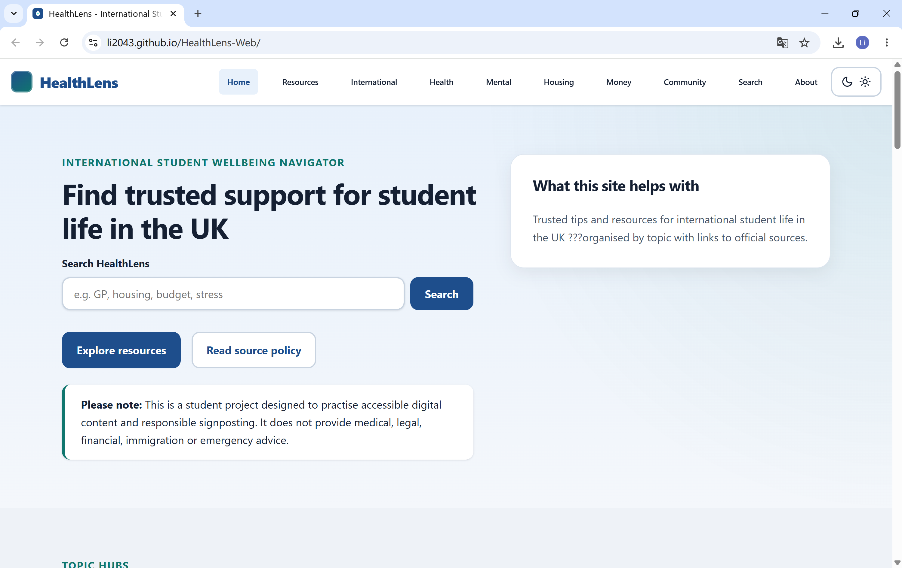
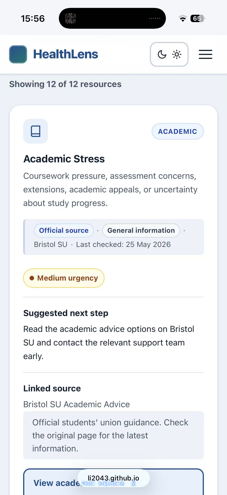
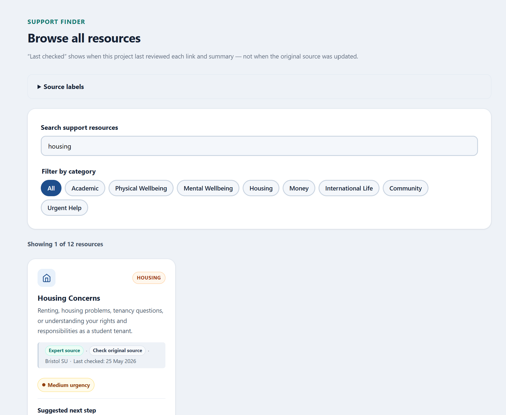
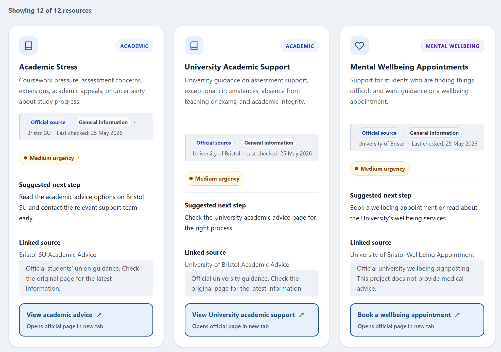
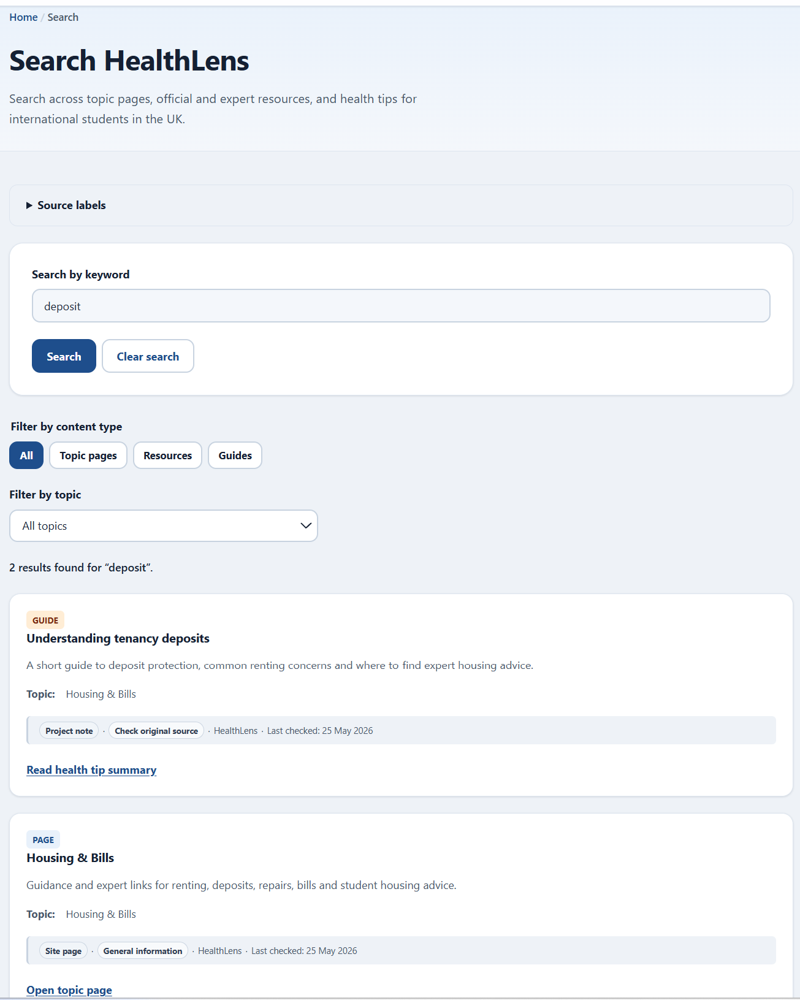

# HealthLens — International Student Wellbeing Navigator

**Live demo:** https://li2043.github.io/HealthLens-Web/  

## Introduction
HealthLens is a multi-page information website designed to help international students in the UK find and understand trusted support resources for student life. It brings together resources and short guide summaries across study support, healthcare, mental wellbeing, housing, money, community, everyday life and urgent help.

The project is not intended to replace official or professional advice. It signposts users to original sources and uses source labels, last-checked dates and clear limitations to help users understand how to interpret each resource.

---

## Why I built this

International students often need to understand several unfamiliar UK systems at once: university support, NHS services, housing rules, budgeting, community activities, urgent help routes and everyday practical life. Useful information exists online, but it is usually distributed across different organisations and written for different audiences.

A search engine can return many results, but it does not always explain:

- which source is official, expert-led, student-facing or commercial
- which resource is relevant to a particular student situation
- what the next step should be
- whether a resource is Bristol-specific, UK-wide or general
- when the link or summary was last checked
- what the information does not cover

HealthLens explores how accessible front-end design, structured content and clear information architecture can make student support routes easier to navigate.

---

### Mobile Layout

```

## Key features

### 1. Multi-page information architecture

HealthLens is organised into topic hubs rather than a single long page. This helps separate different user needs and makes the site easier to scan.

Current pages include:

| Page | Purpose |
|---|---|
| `index.html` | Homepage and project entry point |
| `resources.html` | Searchable and filterable resource library |
| `search.html` | Global site search across pages, resources and guides |
| `guides.html` | Curated short guide cards |
| `international-essentials.html` | Practical starting points for international students |
| `health-healthcare.html` | UK healthcare routes and everyday health signposting |
| `mental-wellbeing.html` | Stress, loneliness, sleep, wellbeing and urgent support routes |
| `housing-bills.html` | Renting, deposits, repairs, bills and housing advice |
| `money-spending.html` | Budgeting, student discounts, everyday spending and money guidance |
| `community-activities-sport.html` | Student groups, volunteering, activities, sport and belonging |
| `about.html` | Source policy, limitations and project explanation |
| `case-study.html` | Portfolio-style explanation of the project process |
| `audit-report.html` | Accessibility and content audit summary |

### 2. Resource library

The Resource Library helps users search and filter support resources by topic. Each card includes a short summary, a suggested next step, a source link and source metadata.

Resource categories include:

- Academic
- Physical Wellbeing
- Mental Wellbeing
- Housing
- Money
- International Life
- Community
- Urgent Help

### 3. Curated guide cards

The project uses `data/articles.json` to manage short, source-based guide cards. These are not long blog posts or professional advice pages. They are structured summaries that help users understand where to start and which official or expert source to read next.

Example guide topics include:

- getting medical care as a student
- vitamin D guidance during the UK winter
- pharmacy, GP, NHS 111 and emergency routes
- managing assessment stress
- understanding tenancy deposits
- budgeting for university life
- using student discounts carefully
- first-month checklist for new international students

### 4. Global search

The global search page builds a client-side search index from:

- topic pages in `data/topics.json`
- resource cards in `data/resources.json`
- curated guides in `data/articles.json`

Users can search by keyword and filter results by content type or topic. Search results include metadata such as source type, topic, audience, risk level and last checked date.

The search is implemented with vanilla JavaScript and static JSON, so it works on GitHub Pages without a backend.

### 5. Source quality labels

HealthLens uses source metadata to help users understand what kind of information they are viewing.

Source labels include:

- Official source
- Expert source
- Student-facing resource
- Commercial platform
- Project note
- Site page

The project also uses **Last checked** dates. This means the date HealthLens last checked that the link worked and that the summary still matched the source. It does not mean the original source was updated on that date.


### 6. Accessibility-informed design

The project is designed with accessibility in mind. It includes:

- semantic HTML structure
- clear heading hierarchy
- skip link
- visible keyboard focus states
- descriptive link text
- labelled forms and inputs
- responsive layouts
- dark mode
- print-friendly CSS
- accessible search status messages
- source labels that use visible text rather than colour alone

This is a WCAG-informed student project, not a formal accessibility certification.

### 7. Case study and documentation

The project includes documentation to make the design and development process easier to review:

- `README.md`
- `CHANGELOG.md`
- `accessibility-checklist.md`
- `accessibility-test-report.md`
- `docs/accessibility-audit.md`
- `docs/content-audit.md`
- `docs/manual-test-plan.md`
- `case-study.html`
- `audit-report.html`

These documents explain the project scope, accessibility checks, content boundaries, source policy, manual testing and future improvements.

---

## Technology used

### 1. Front-end

- HTML
- CSS
- JavaScript

### 2. Data and content structure

- JSON-based content files
- `data/resources.json`
- `data/articles.json`
- `data/topics.json`
- `data/care-options.json`

### 3. Design and workflow

- Git and GitHub
- GitHub Pages deployment
- Figma for layout planning and visual direction
- Chrome DevTools for inspection and testing
- Manual accessibility and content audit documents

---

## Project structure

```text
HealthLens-Web/
├── index.html
├── resources.html
├── search.html
├── guides.html
├── international-essentials.html
├── health-healthcare.html
├── mental-wellbeing.html
├── housing-bills.html
├── money-spending.html
├── community-activities-sport.html
├── about.html
├── case-study.html
├── audit-report.html
├── styles.css
├── script.js
├── data/
│   ├── resources.json
│   ├── articles.json
│   ├── topics.json
│   └── care-options.json
├── docs/
│   ├── accessibility-audit.md
│   ├── content-audit.md
│   └── manual-test-plan.md
├── accessibility-checklist.md
├── accessibility-test-report.md
├── CHANGELOG.md
└── README.md
```
---

## Design and content decisions

### User-centred information architecture

The site is organised around likely student needs rather than internal service names. Instead of expecting users to know which department or organisation they need, HealthLens groups content by everyday situations: healthcare, housing, money, mental wellbeing, community and settling into the UK.

This makes the site more approachable for students who are unfamiliar with UK university systems or public services.

### Content separated from rendering logic

Resources, guides and topic pages are stored in structured JSON files where possible. This separates content from interface rendering and makes the project easier to maintain.

For example, resource cards include fields such as:

```text
title
category
description
nextStep
sourceType
sourceAuthority
audience
riskLevel
lastChecked
sourceUrl
```

This makes the project closer to a lightweight content-managed information system rather than a static list of links.

### Source governance

Higher-risk topics such as healthcare, housing, money and international student support require careful boundaries. HealthLens therefore labels sources by type and authority, and explains what the project does and does not do.

The source policy helps users distinguish between official service information, expert guidance, student-facing context, commercial platforms and HealthLens-written summaries.

### Accessible interaction patterns

The interface uses standard HTML controls wherever possible. Search fields, filters, accordions, forms and links are designed to remain keyboard accessible. Search result updates use readable status text, and visual badges include text rather than relying on colour alone.

### Plain-English editorial style

Guide cards use short summaries, key points and next-step language to help users decide whether a source is relevant before opening it.

The content avoids unsafe wording. For example, healthcare content is framed as service navigation and official signposting, not symptom assessment or medical advice.

---

## How this project reflects digital content and front-end work

HealthLens was designed to demonstrate the overlap between front-end implementation, digital content structure, accessibility and user-centred communication.

The project demonstrates the ability to:

- build and maintain multi-page web content
- create responsive layouts with HTML, CSS and JavaScript
- structure and render content from JSON data
- design search and filtering for information discovery
- write clear summaries and next-step guidance
- label sources transparently
- consider accessibility from the start of the design
- document testing, limitations and future improvements
- balance visual design, content design and implementation details

These choices reflect the practical work involved in maintaining user-facing digital services: understanding user needs, translating content into usable page structures, keeping information accurate and accessible, and communicating clearly to technical and non-technical audiences.

---

## Running locally

Because the site loads JSON files with JavaScript, it should be run through a local server rather than opened by double-clicking `index.html`.

Example:

```bash
python3 -m http.server 8000
```

Then open:

```text
http://localhost:8000
```

---

## Deployment

The project is designed for GitHub Pages.

Recommended setup:

1. Push the project to GitHub.
2. Go to repository **Settings**.
3. Open **Pages**.
4. Select deployment from the main branch.
5. Use the project root as the publishing source.
6. Check that internal links use relative paths.

---

## Testing checklist

Before publishing or sharing the project, check:

- all pages load correctly
- navigation works across all pages
- search works on `search.html`
- resource filters work on `resources.html`
- guide cards render correctly
- external links open correctly
- source labels display correctly
- dark mode remains readable
- print layout remains readable
- mobile layout works
- keyboard navigation works
- console shows no JavaScript errors
- content does not overclaim professional advice
- README and changelog match the current version

---

## Limitations

HealthLens is a student project and should be interpreted as a portfolio prototype.

Current limitations:

- It is not an official university or students’ union service.
- It does not replace the original linked sources.
- It does not provide professional medical, legal, financial, immigration or emergency advice.
- Link accuracy depends on periodic manual review.
- Accessibility checks are WCAG-informed but not a formal certification.
- The site has not yet been tested with a large group of real international student users.

---

## Future improvements

Potential next steps:

- test the site with international students
- improve search ranking
- add more curated guide cards
- add multilingual summaries
- add a clearer content review workflow
- improve screen reader testing
- add more visual documentation and screenshots
- migrate to a static site generator if the content grows

---

## Credits and source policy

HealthLens links to official and expert sources where relevant, including university, students’ union, NHS, GOV.UK, UKCISA, Citizens Advice, Shelter and MoneyHelper resources.

External sources are linked for user reference. HealthLens does not claim affiliation with these organisations.

If icons or illustrations are used, add credits here:

```text
Icons:
Add icon source and license here.

Images:
Add image source and license here.

If all icons are self-created:
All decorative SVG illustrations and icons were created for this student project.
```

---

## Version history

See [`CHANGELOG.md`](CHANGELOG.md) for detailed version notes.

Current major milestones:

- V0.7 — Positioning cleanup
- V0.8 — Multi-page information architecture
- V0.9 — Articles data model and curated guide cards
- V1.0 — Global search
- V1.1 — Source quality labels and last checked dates
- V1.2 — Accessibility / content audit and case study
